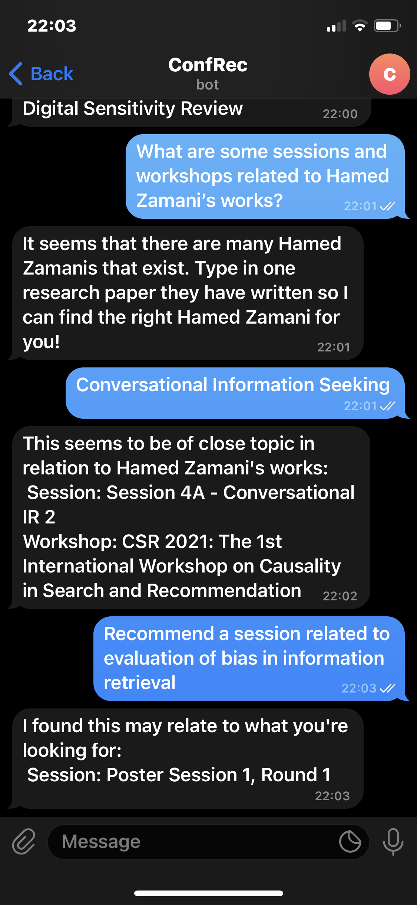
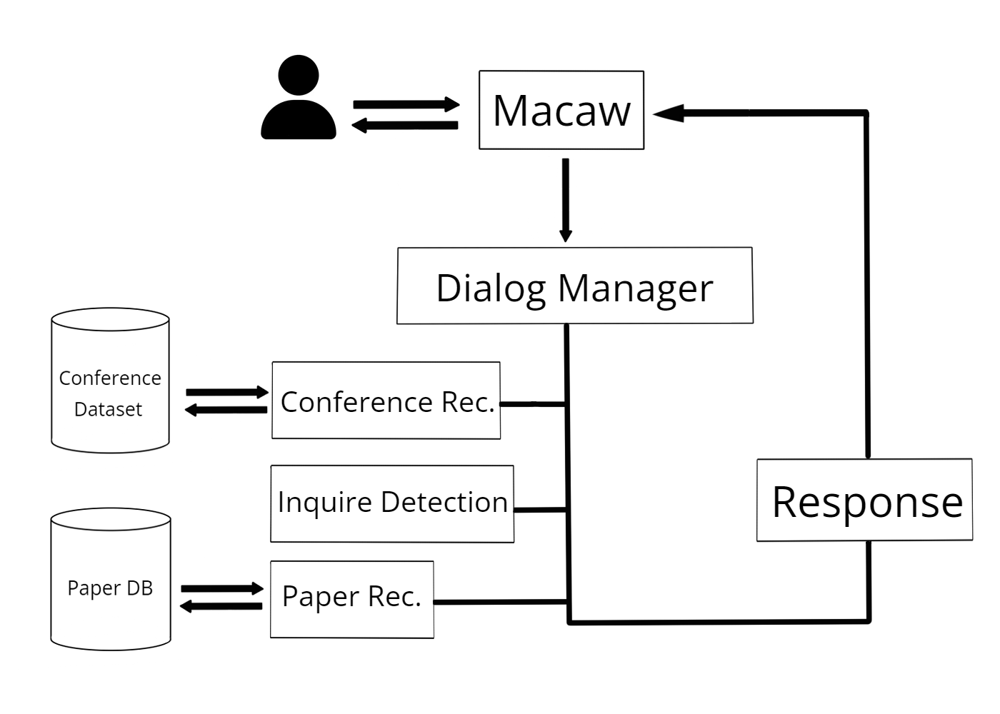

# ReCo: A Retrieval-Based QA Dialogue System on Scientific Conferences
An ERSP project, supervised by Professor Hamed Zamani, under the Center of Intelligent Information Retrieval (CIIR) lab at UMass Amherst. ReCo is a task-oriented dialogue system that recommends conference events and research papers to users, and answers simple factual questions about conference events (option selection). It can make recommendations based on keywords or userprofiles, which is built off a specified author's works.

The given conference dataset, which was manually extracted, is only of SIGIR 21, so it can only support queries related to that conference as of right now. Currently, we don't have an automatic parser to extract this kind of data from any conference website.

Below are some screenshots of the bot in use via the telgram interface. The left screenshot is of option selection, while the right is of recommendation.




## ReCo Architecture
ReCo follows the Macaw framework, a platform with modular architecture meant for conversational information seeking (CIS) research. The interface is implemented via Macaw, so the communication between the dialogue system and user is aided by Macaw. The high-level architecture of ReCo is shown below:



#### Retrieval
Recommendations are made via a dense retrieval model, which employs the SentenceTransformers and Faiss library. A sparse retrieval model, using BM25 as the ranking function, is also used to detect what conference event the user may be referring to for option selection.

## Installation
Most dependencies can be installed via the requirements.txt:
```
pip install -r requirements.txt
```

You will also need to install MongoDB server.

The parsed arXiv dataset is not posted here due to size. Additionally, if you do not have a GPU, it will take *very* long to vectorize all the entries in the dataset. We provide the used arXiv dataset and the pickle files for the dense index and vectors of the arXiv dataset in this Google Drive folder. Please note that the dataset is around 0.465 GB, while the pickle files are 1 GB each. It took approximately 1 hour to create the pickle files using a 2080ti GPU.

If you install the pickle files, please store them in the same directory that you indicate to be the 'index path' (see live_main.py for more details).

## Running
First, run the MongoDB server (mongod.exe). The default interface used is telegram; this can also be changed to standard IO or file IO for development purposes (See Macaw). Then, run the main script:
```
python3 live_main.py
```

## Acknowledgements
We would like to thank Professor Hamed Zamani in helping to conceptualize this project, and our PhD mentor Chris Samarinas who guided and advised us on project technicalities (as well as helping with code)!
